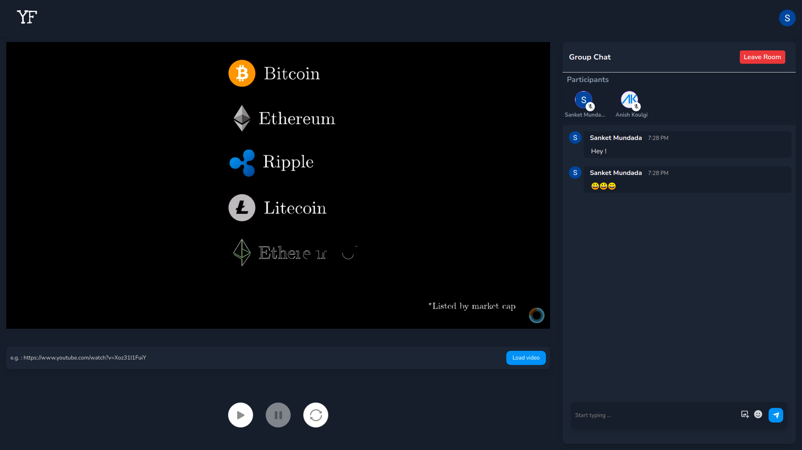

# YoutubeWithFriends 

## Real time collaboration for Youtube videos

YoutubeWithFriends is a platform for watching Youtube videos collaboratively.

## Need for such platform

Most of us like to learn new things by watching videos on Youtube and many a times we tend to discuss these with our friends.
Along with youtube a communication channel is also needed for exploring things with friends.  
This application lets users watch youtube videos in a group along with chat facility.

## Facilities Provided

- Creation of rooms and joining of rooms
- Watching a Youtube video in a particular room simultaneously
- Basic video functionalities
  - Play
  - Pause
  - Load
  - Syncronize
- Basic Chat Functionality along with emoji and image support

## Screenshots

## Contributors

- Anish Koulgi [Github](https://github.com/anishkoulgi) | [LinkedIn](https://www.linkedin.com/in/anishkoulgi/)
- Sanket Mundada [Github](https://github.com/Sanketmundada) | [LinkedIn](https://www.linkedin.com/in/sanket-mundada/)
